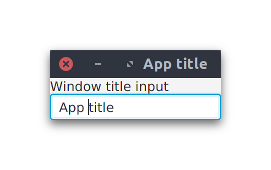

# cljfx

Cljfx is a library that tries to provide reagent-like experience for
JavaFX applications.

## Rationale

I wanted to have an elegant declarative wrapper around JavaFX and
couldn't find one. Cljfx is inspired by react, reagent, re-frame and
fn-fx, which is also a declarative wrapper of JavaFX, but I found it not
composable enough: I wanted to have just data and functions for
describing application instead of using macros to define classes.

## Introduction

### Hello world

Minimal example:
```clj
(ns example
  (:require [cljfx.api :as cljfx]))

(cljfx/on-fx-thread
  (cljfx/create-component
    [:stage {:showing true :title "Cljfx example" :width 300 :height 100}
     [:scene
      [:v-box {:alignment :center}
       [:label "Hello world"]]]]))
```
Evaluating this code will create and show this window:


### App

To be truly useful, there should be some state and changes over time,
for this matter there is an `app` abstraction, which is a function that
you may call whenever you want with new hiccup-like description, and
cljfx will advance all the mutable state underneath to match this
description. Example:
```clj
(def app
  (cljfx/create-app))

(defn root [showing]
  [:stage {:showing showing}
   [:scene
    [:v-box {:padding 50}
     [:button
      {:text "close"
       :on-action (fn [_] (app [root false]))}]]]])

(app [root true])
```
Evaluating this code will show this:


Clicking `close` button will hide this window.

### Atoms

Example above works, but it's not very convenient: what we'd really like
is to have a single global state as a value in an atom, derive our
description of JavaFX state from this value, and change this atom's
contents instead. Here is how it's done:
```clj
;; Define application state

(def *state
  (atom {:title "App title"}))

;; Define render functions

(defn title-input [title]
  [:text-field
   {:on-text-changed #(swap! *state assoc :title %)
    :text title}])

(defn root [{:keys [title]}]
  [:stage {:showing true :title title}
   [:scene
    [:v-box
     [:label "Window title input"]
     [title-input title]]]])

;; Create app with middleware that maps incoming data - description -
;; to hiccup description that can be used to render JavaFX state.
;; Here description is just passed as an argument to function component.

(def app
  (cljfx/create-app
    :middleware (cljfx/wrap-map-desc (fn [desc]
                                       [root desc]))))

;; Convenient way to add watch to an atom + immediately render app

(cljfx/mount-app *state app)
```
Evaluating code above pops up this window:



Editing input then immediately updates displayed app title.

### Metas

Some components use description's meta. Main uses are:

1. Reordering of nodes (instead of re-creating them) in parents that may
   have many children. Descriptions that have `:key` in meta during
   advancing get reordered instead of recreated if their position in
   child list is changed. Consider this example:
   ```clj
   (let [component-1 (cljfx/create-component
                       [:v-box
                        ^{:key 1} [:label "- buy milk"]
                        ^{:key 2} [:label "- buy socks"]])
         [milk-1 socks-1] (vec (.getChildren (cljfx/instance component-1)))
         component-2 (cljfx/advance-component
                       component-1
                       [:v-box
                        ^{:key 2} [:label "- buy socks"]
                        ^{:key 1} [:label "- buy milk"]])
         [socks-2 milk-2] (vec (.getChildren (cljfx/instance component-2)))]
     (and (identical? milk-1 milk-2)
          (identical? socks-1 socks-2)))
   => true
   ```
   With `:key`-s specified, advancing of this component reordered
   children of VBox, and didn't change text of any labels, because their
   description stayed the same.
2. Setting pane constraints. If node is placed inside a pane, pane can
   layout it differently by looking into properties map of a node. These
   properties can be specified via meta:
   ```clj
   (cljfx/on-fx-thread
     (cljfx/create-component
       [:stage {:showing true}
        [:scene
         [:stack-pane
          [:rectangle {:width 200 :height 200 :fill :lightgray}]
          ^{:alignment :bottom-left :margin 5}
          [:label "bottom-left"]
          ^{:alignment :top-right :margin 5}
          [:label "top-right"]]]]))
   ```
   Evaluating code above produces this window:

   

   For a more complete example of available pane metas, see
   [examples/e07_panes.clj](examples/e07_panes.clj)

## More examples

There are various examples available in [examples](examples) folder.

## License

TBD, need to consult my employer first

## TODO

- hiccup->maps
- optional flatten in wrap-many
- better explanation regarding fn-fx
- better support for multiple windows
- expand on props and composite lifecycle. What's known about them:
  - ctor:
    - scene requires root, root can be replaced afterwards
    - xy-chart requires axis, they can't be replaced afterwards
  - some props do not create instances, they use provided instead
    (dialog pane in dialog)
  - is it possible to inject components/lifecycles into cells? they are
    a bit different (triggered via updateItem), and instances are
    created for us, but otherwise it's just a node and we have props for
    them
  - prop in composite lifecycle may be a map or a function taking
    instance and returning prop!
  - changing media should re-create media player

- big app with everything in it to check if/how it works (generative
  tests maybe?)
- extract-rest instead of default-props
- controlled props (mostly in controls, also stage's `:showing`)
- `:on-text-changed` handler dispatches during advancing, it shouldn't
- default `:managed` properties in controls
- default focus traversable of controls!
- default style classes!
- default on-x-changed prop change listeners!
- advanced docs: lifecycles, opts, contexts, map-event-handlers,
  styles etc.

## Food for thought
- `:points` in polyline has unexpected behavior for first-time user
- research lazy-loading of classes
- wrap-factory may use some memoizing and advancing
- prop lifecycle
- should I use namespaced keywords in fx components?
- how to handle dialogs, animations and other possibly missed things?
- escape hatch to force-re-render everything?
- make jfx-media and jfx-web optional?
- update to same desc should be identical (component-vec)